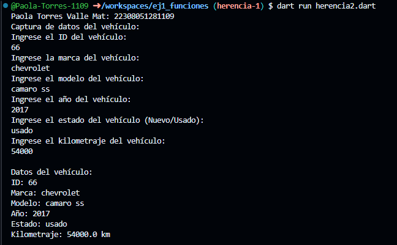
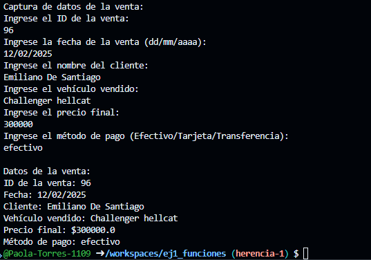

crear la clase Vehiculo con los atributos (id_vehiculo, mara, modelo, anio, estado, kilometraje) con una función capturadatos(), con interacción de interfaz de usuario. crear la clase DatosVehiculo con herencia Vehiculo y una función mostrarDatos(). lenguaje dart

crear la clase Ventas con los atributos (id_venta, fecha, cliente_a, vehiculo_v, precio_f, metodo_p) con una función capturadatos(), con interacción de interfaz de usuario. crear la clase DatosVentas con herencia Ventas y una función mostrarDatos(). lenguaje dart

